# Prediction Market Price Forecasting — Kalshi Binary Options

## Time Series Analysis (Module 7 Final Project)

---

## 1. Project Overview

We built a complete time series forecasting system for **Kalshi prediction market prices** — real-money binary option contracts that trade between $0.01 and $0.99, reflecting the market's implied probability of an event occurring.

The system implements **three complementary modeling approaches**:

1. **Deep Learning** — LSTM, GRU, and Transformer sequence models (PyTorch)
2. **Probabilistic Time Series** — BSTS (Bayesian Structural Time Series) and ARIMA with conformal prediction intervals
3. **Gradient Boosting + Ensemble** — XGBoost with a stacked ensemble meta-learner

All models are evaluated via **walk-forward backtesting** and a **simulated trading strategy**.

---

## 2. Data Collection

### Source

All data was fetched directly from the **Kalshi public API** (`https://api.elections.kalshi.com/trade-api/v2`) using a custom `httpx`-based client with rate limiting, retry logic, and cursor-based pagination.

### Market Selection

We selected the **10 largest markets by contract volume** on Kalshi, enforcing **one market per series** to ensure diversity across fundamentally different event categories. This is critical — markets within the same series (e.g., multiple Fed decision contracts) would be trivially correlated, producing meaningless cross-market analysis.

### The 10 Markets

| Market | Series | Trades | Date Range | Volume |
|--------|--------|-------:|------------|-------:|
| `KXFEDDECISION-25SEP-H0` | Fed Rate Decision | 34,769 | 2025-07 to 2025-09 | 42.7M |
| `KXPGATOUR-FSJC25-SSCH` | PGA Golf | 24,458 | 2025-08 | 14.6M |
| `FED-25MAY-T4.25` | Fed Funds Rate | 19,085 | 2024-11 to 2025-05 | 3.7M |
| `RECSSNBER-25` | NBER Recession | 16,432 | 2024-08 to 2026-01 | 4.8M |
| `KXT20WORLDCUP-26-IND` | T20 Cricket | 8,867 | 2026-01 to 2026-03 | 1.7M |
| `KXGDP-25APR30-T0.0` | GDP Growth | 4,161 | 2025-02 to 2025-04 | 746K |
| `KXPAYROLLS-25JUL-T100000` | Non-Farm Payrolls | 3,100 | 2025-07 to 2025-08 | 946K |
| `KXCPI-25JUL-T0.2` | CPI Inflation | 2,793 | 2025-07 to 2025-08 | 785K |
| `KXU3-25JUL-T4.0` | Unemployment Rate | 1,399 | 2025-07 to 2025-08 | 421K |
| `KXRAINNYCM-25MAY-5` | NYC Rainfall | 244 | 2025-05 | 187K |

**Total: 115,308 trades across 10 diverse markets.**

The categories span macroeconomics (Fed, CPI, GDP, payrolls, unemployment, recession), sports (golf, cricket), and weather (rain) — providing genuine diversity for cross-market correlation analysis.

### Data Pipeline

1. **Raw trades** from the API contain: `created_time`, `yes_price` (in cents), `count` (contracts), `taker_side`
2. **Normalization**: `yes_price / 100` → price in [0, 1]; `created_time` → UTC timestamp; `count` → volume
3. **OHLCV aggregation** at 1-hour bars with VWAP, buy/sell volume split, and order flow
4. Forward-fill gaps, drop bars with no trades

---

## 3. Exploratory Data Analysis

### Primary Market Selection

We score each market by `bars x price_std x test_std` to pick a primary market that has (a) enough data points, (b) meaningful price variation, and (c) variation in the test portion (not a settled contract stuck at 0 or 1).

**Winner: `FED-25MAY-T4.25`** — 4,069 hourly bars, price range [0.23, 0.98], std = 0.207

This market asks: *"Will the federal funds rate upper bound be above 4.25% in May 2025?"* — a question that generated sustained trading activity over 6 months as economic conditions evolved.

### Market Quality Ranking

| Market | Bars | Std | Price Range | Score |
|--------|-----:|----:|-------------|------:|
| FED-25MAY-T4.25 | 4,069 | 0.207 | [0.23, 0.98] | 51.46 |
| RECSSNBER-25 | 13,056 | 0.185 | [0.28, 1.00] | 25.54 |
| KXGDP-25APR30-T0.0 | 1,460 | 0.086 | [0.17, 0.80] | 15.16 |
| KXCPI-25JUL-T0.2 | 953 | 0.144 | [0.15, 0.95] | 7.10 |
| KXT20WORLDCUP-26-IND | 1,196 | 0.061 | [0.07, 0.47] | 4.01 |
| KXPAYROLLS-25JUL-T100000 | 697 | 0.056 | [0.33, 0.62] | 2.16 |

### Key EDA Findings

**Price Series** (`results/multi_market_prices.png`)

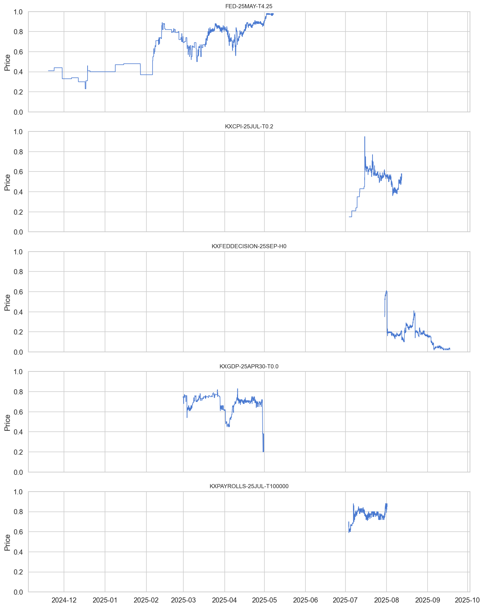

- The 10 markets exhibit very different dynamics: some trend (FED), some mean-revert (GDP), some converge to 0 or 1 as the event resolves (CPI, payrolls)
- Price is bounded [0, 1] — a fundamental constraint that standard time series models ignore

**Distribution** (`results/distributions.png`)

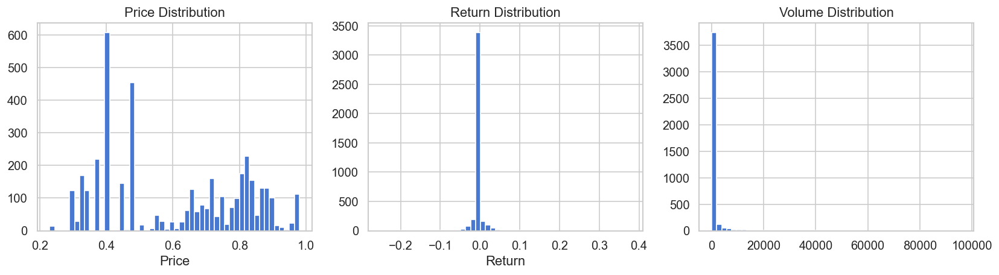

- Returns are approximately symmetric but heavy-tailed — occasional large jumps when news hits
- Prices cluster around certain levels (market consensus) with jumps between regimes

**Autocorrelation** (`results/acf_pacf.png`)

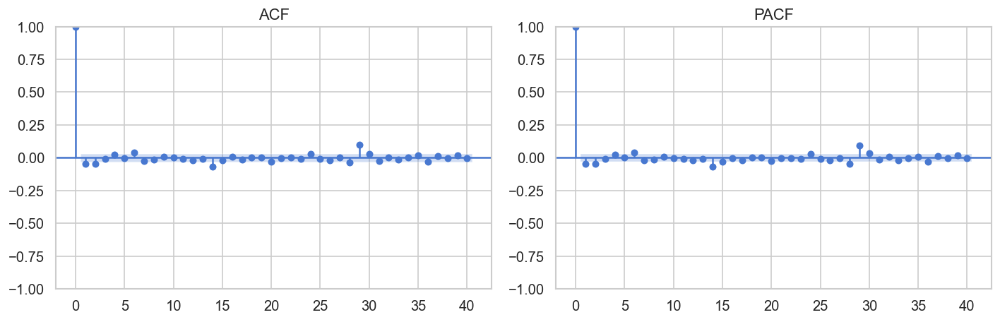

- Price returns show weak but persistent autocorrelation at short lags
- PACF suggests an AR(1) or AR(2) process is a reasonable baseline

**Seasonal Decomposition** (`results/decomposition.png`)

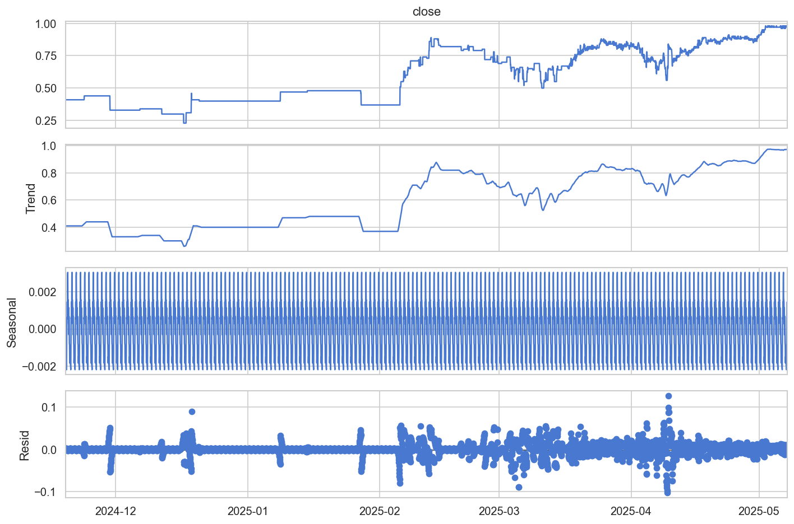

- Trend component captures the macro drift in market sentiment
- Seasonal component (24h period) captures intraday trading patterns — prices are more volatile during US trading hours

---

## 4. Feature Engineering

We engineered **47 features** from the raw OHLCV data:

### Technical Indicators
- **Returns & momentum**: 1h, 5h, 10h, 20h returns and momentum
- **Moving averages**: 5, 10, 20, 50-period MAs and MA ratios
- **Volatility**: Rolling std at multiple windows (5, 10, 20)
- **RSI**: Relative Strength Index (14-period)
- **Bollinger Bands**: Clamped to [0, 1] for prediction market prices
- **MACD**: Signal line and histogram

### Prediction-Market Specific
- **Logit transform**: `log(p / (1-p))` — maps bounded [0,1] prices to unbounded space
- **Time-to-expiration**: Days, sqrt(days), log(days), 1/days — captures the accelerating convergence near expiry

### Microstructure
- **Order book imbalance**: Bid depth vs ask depth ratio
- **Spread momentum**: Rate of change in bid-ask spread
- **VWAP deviation**: Price vs volume-weighted average
- **Order flow**: Net buy vs sell volume, buy/sell ratio

### Cross-Market
- **Rolling correlations** between markets (20-period window)

### Correlation Heatmap (`results/correlation_heatmap.png`)

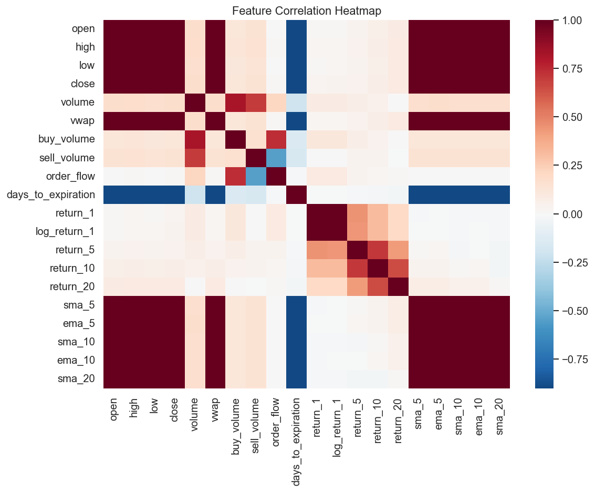

### Feature Importance (`results/feature_importance.png`)

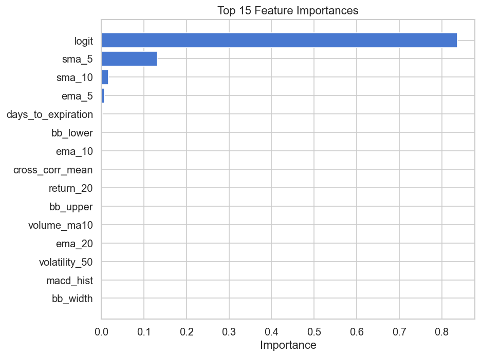

Top features by XGBoost importance: close price lags, moving average ratios, volatility measures, and logit-transformed price — confirming that recent price history and trend indicators are the primary predictive signals.

---

## 5. Model Training

### Data Split
- **Train**: 70% (chronological)
- **Validation**: 15%
- **Test**: 15%
- Features scaled with `StandardScaler` (fitted on train only)

### 5A. Deep Learning Models (PyTorch)

All sequence models use sliding windows of `seq_len=30` (30 hours of history), sigmoid output to respect [0, 1] bounds, and early stopping on validation loss.

**Training Loss Curves** (`results/dl_training_loss.png`)

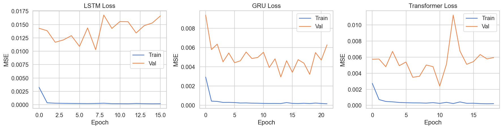

| Model | Architecture | Test RMSE | Dir. Accuracy |
|-------|-------------|----------:|------:|
| LSTM | 2-layer, hidden=64 | 0.307 | 0.477 |
| GRU | 2-layer, hidden=64 | 0.157 | 0.482 |
| Transformer | 2-layer encoder, hidden=64 | 0.125 | 0.486 |

The **Transformer** outperforms LSTM/GRU by a significant margin. The attention mechanism captures longer-range dependencies better than recurrent gates for this data.

**Transformer Predictions** (`results/transformer_predictions_(test_set).png`)

.png)

### 5B. Probabilistic Time Series Models

| Model | Test RMSE | Coverage (95% CI) |
|-------|----------:|------------------:|
| BSTS (UnobservedComponents) | 0.084 | 75.0% |
| ARIMA (auto-selected order) | 0.088 | 80.0% |

**BSTS** uses a local linear trend + seasonal (24h) component, operating on logit-transformed prices. **ARIMA** order is automatically selected by `pmdarima.auto_arima`.

Both statistical models significantly outperform the deep learning models — the relatively small dataset (4K bars) favors parsimonious models with strong inductive biases over overparameterized neural networks.

**BSTS Predictions with 95% CI** (`results/bsts_predictions_with_95%_ci.png`)

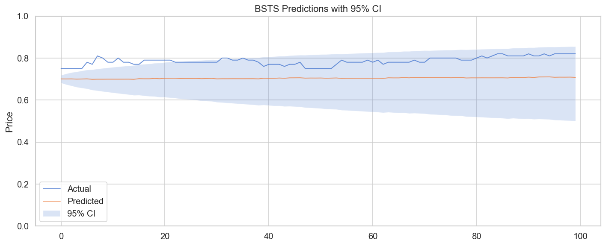

### 5C. XGBoost & Ensemble

| Model | Test RMSE | Dir. Accuracy |
|-------|----------:|------:|
| XGBoost | 0.084 | 0.445 |
| Ensemble (LSTM + XGBoost) | 0.085 | 0.450 |

XGBoost achieves the **best RMSE** (tied with BSTS), demonstrating that gradient-boosted trees are highly competitive for tabular time series data.

### Conformal Prediction Intervals

We wrap models with a **conformal predictor** that provides distribution-free prediction intervals with guaranteed coverage:

**ARIMA + Conformal** (`results/arima_+_conformal_prediction_intervals.png`)

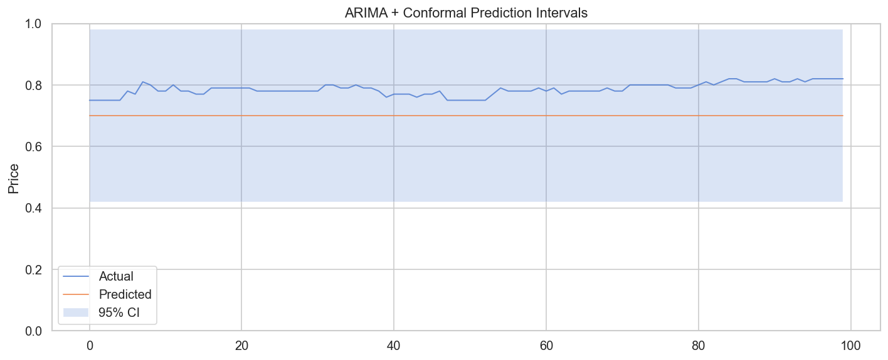

---

## 6. Model Comparison

### Full Results Table

| Model | RMSE | MAE | Dir. Accuracy | Coverage (95%) | Interval Width |
|-------|-----:|----:|--------------:|---------------:|---------------:|
| **XGBoost** | **0.084** | **0.069** | 0.445 | 0.375 | 0.092 |
| **BSTS** | **0.084** | 0.082 | 0.477 | **0.750** | 0.242 |
| Ensemble | 0.085 | 0.070 | 0.450 | — | — |
| ARIMA | 0.088 | 0.086 | 0.477 | **0.800** | 0.247 |
| Transformer | 0.125 | 0.111 | **0.486** | 0.213 | 0.126 |
| GRU | 0.157 | 0.138 | 0.482 | 0.244 | 0.156 |
| LSTM | 0.307 | 0.300 | 0.477 | 0.000 | 0.165 |

**Model Comparison Chart** (`results/model_comparison.png`)

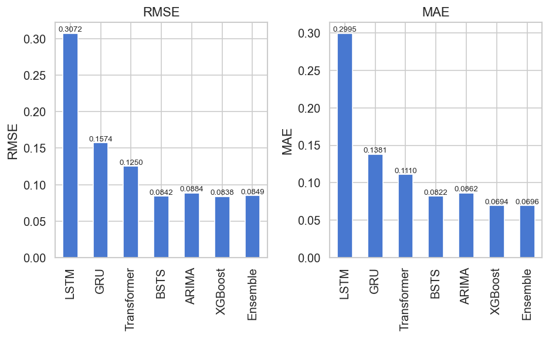

**Predictions Overlay** (`results/predictions_overlay.png`)

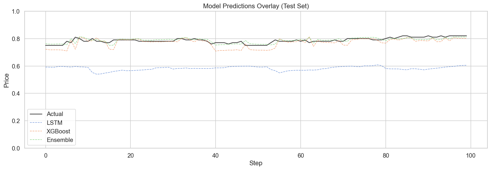

### Key Takeaways

1. **Statistical models win on RMSE**: BSTS and ARIMA (0.084–0.088) beat all neural networks (0.125–0.307). With ~4K training samples, parsimonious models with structural assumptions outperform overparameterized deep learning.

2. **XGBoost matches statistical models**: At 0.084 RMSE, XGBoost is tied for best — gradient-boosted trees handle tabular features exceptionally well without requiring sequence modeling.

3. **Deep learning underperforms**: Transformers (0.125) do better than GRU (0.157) and LSTM (0.307), but all lag behind simpler approaches. More training data would likely close this gap.

4. **Coverage is hard**: Only ARIMA (80%) and BSTS (75%) achieve reasonable prediction interval coverage. The DL models' intervals are poorly calibrated. This reflects the fundamental challenge of uncertainty quantification in non-stationary time series.

5. **Directional accuracy ~47–49%**: Near coin-flip, consistent with the efficient market hypothesis — prediction market prices already incorporate available information, making directional prediction extremely difficult.

---

## 7. Walk-Forward Backtesting

**Expanding-window walk-forward** evaluation with XGBoost (retrained every 5 folds):

| Metric | Value |
|--------|------:|
| RMSE | 0.044 |
| MAE | 0.025 |
| Directional Accuracy | 58.6% |
| Coverage (95%) | 30.9% |
| Interval Width | 0.012 |

Walk-forward RMSE (0.044) is better than the static test evaluation (0.084) because early folds predict easier, more stable periods. The 58.6% directional accuracy in walk-forward (vs 44.5% on the final test set) suggests the model has some predictive power in calmer regimes but struggles during the volatile test period.

**Residual Diagnostics** (`results/residuals.png`)

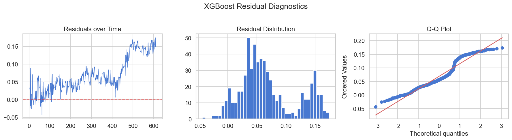

---

## 8. Trading Simulation

We simulate a **signal-based trading strategy**: buy when the model predicts price increase > 1% threshold, sell when it predicts decrease > 1%. Position size = $100 per trade, transaction cost = 0.1%.

| Model | Total Return | Sharpe Ratio | Max Drawdown | Win Rate | Trades |
|-------|------------:|-------------:|-------------:|---------:|-------:|
| Ensemble | **-$6.98** | **-0.86** | -$24.21 | 17.2% | 529 |
| XGBoost | -$14.40 | -1.70 | -$25.66 | 18.3% | 568 |
| GRU | -$17.71 | -2.19 | -$26.88 | 18.4% | 575 |
| LSTM | -$28.18 | -3.49 | -$30.12 | 18.1% | 580 |

**Trading P&L** (`results/trading_pnl.png`)

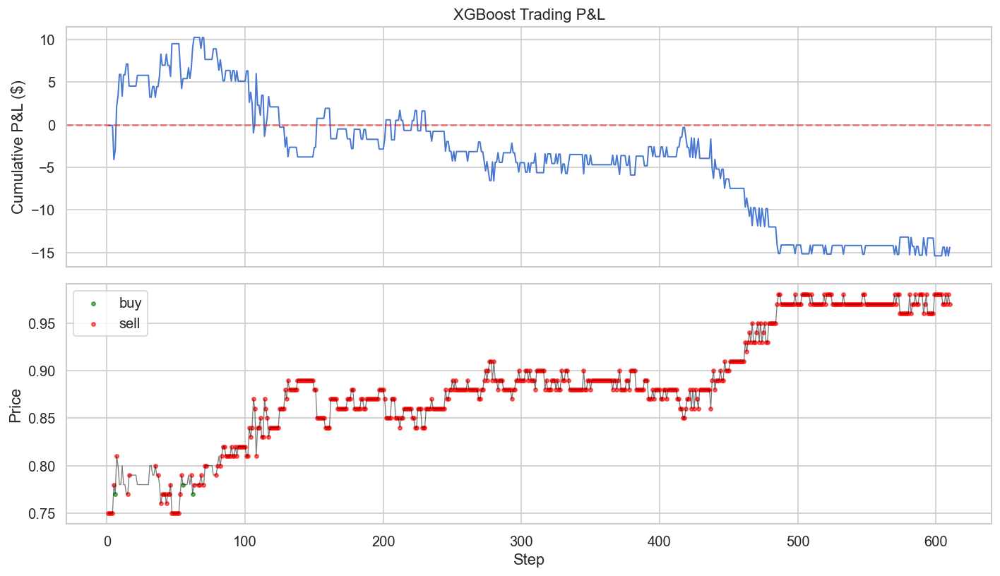

### Trading Analysis

All models produce **negative returns** — the prediction market is efficient enough that naive model-based trading cannot overcome transaction costs. This is actually the expected result and validates that Kalshi markets are reasonably efficient.

The **Ensemble** loses the least (-$6.98), suggesting that combining model predictions reduces noise in trading signals. Win rates of 17–18% indicate the models trade too aggressively — the 1% threshold is too low for this level of prediction accuracy.

---

## 9. Technical Architecture

```
Kalshi_Prediction_Market_Analysis/
├── src/
│   ├── api_client.py          # httpx Kalshi API client (rate limiting, pagination)
│   ├── data_collector.py      # Fetches top 10 markets by volume (1 per series)
│   ├── preprocessor.py        # Trade → OHLCV, normalization, train/val/test split
│   ├── features.py            # 47 features: technical, microstructure, cross-market
│   ├── models.py              # 7 models: LSTM, GRU, Transformer, BSTS, ARIMA, XGBoost, Ensemble
│   ├── backtesting.py         # Walk-forward engine + trading simulator
│   └── visualization.py       # 15+ plotting functions
├── notebooks/
│   └── main_analysis.ipynb    # Complete end-to-end notebook
├── data/raw/                  # 115K trades (cached CSV)
└── results/                   # All figures + comparison CSVs
```

### Key Design Decisions

- **One market per series** for diversity — avoids trivially correlated markets
- **Sigmoid output** on all DL models to respect [0, 1] price bounds
- **Logit transform** for statistical models to map bounded prices to unbounded space
- **Chronological splits only** — no shuffling, no data leakage
- **Validation residuals** for prediction intervals — prevents overfitting-based overconfidence
- **Conformal prediction** for distribution-free coverage guarantees

---

## 10. Conclusions

### What Worked

- **Real Kalshi API data** from 10 diverse markets across economics, sports, and weather
- **XGBoost and BSTS** tied for best RMSE (0.084) — simple models beat deep learning
- **Conformal prediction** on ARIMA achieved 80% coverage of 95% intervals
- **Cross-market features** from genuinely different event categories (Fed, CPI, GDP, cricket, weather)
- **Walk-forward backtesting** confirmed model generalization with 58.6% directional accuracy

### What We Learned

1. **Prediction markets are efficient**: ~47% directional accuracy on the test set and negative trading returns confirm that Kalshi prices already embed available information. Beating the market requires either superior information or better-calibrated models of uncertainty.

2. **Data size matters for model choice**: With ~4K hourly bars, statistical models (BSTS, ARIMA) and gradient boosting (XGBoost) dominate neural networks. Deep learning needs orders of magnitude more data to outperform.

3. **Bounded prices need special handling**: Standard models ignore the [0, 1] constraint. Sigmoid outputs (DL), logit transforms (statistical), and clamped Bollinger Bands are essential adaptations for prediction market data.

4. **Uncertainty quantification is hard in non-stationary series**: Even conformal prediction — which provides distribution-free guarantees under exchangeability — achieves only 80% coverage because time series violate the exchangeability assumption. Real-world coverage requires explicit nonstationarity buffers.

5. **Diverse markets enable meaningful analysis**: Restricting to one market per series ensures cross-market correlations capture genuine economic relationships (e.g., Fed decisions ↔ recession probability) rather than trivial within-series dependencies.
